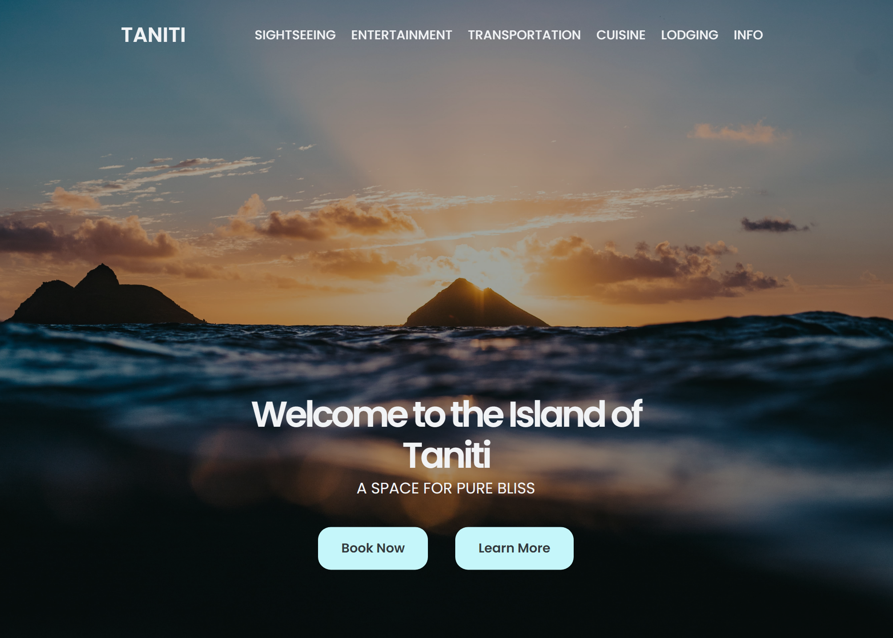
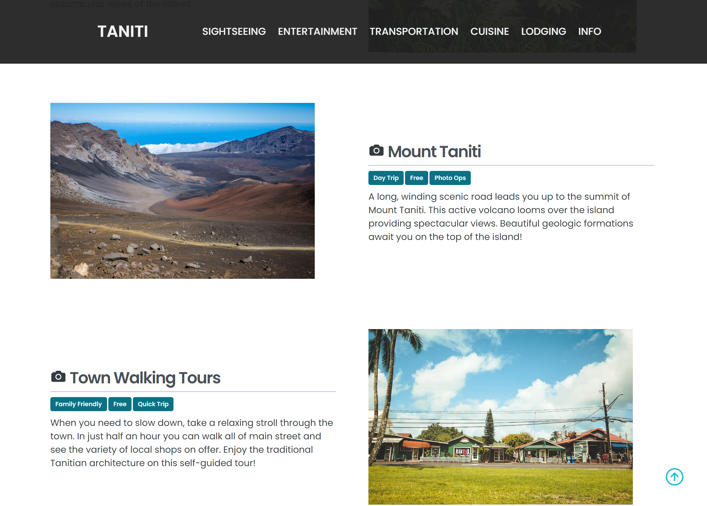
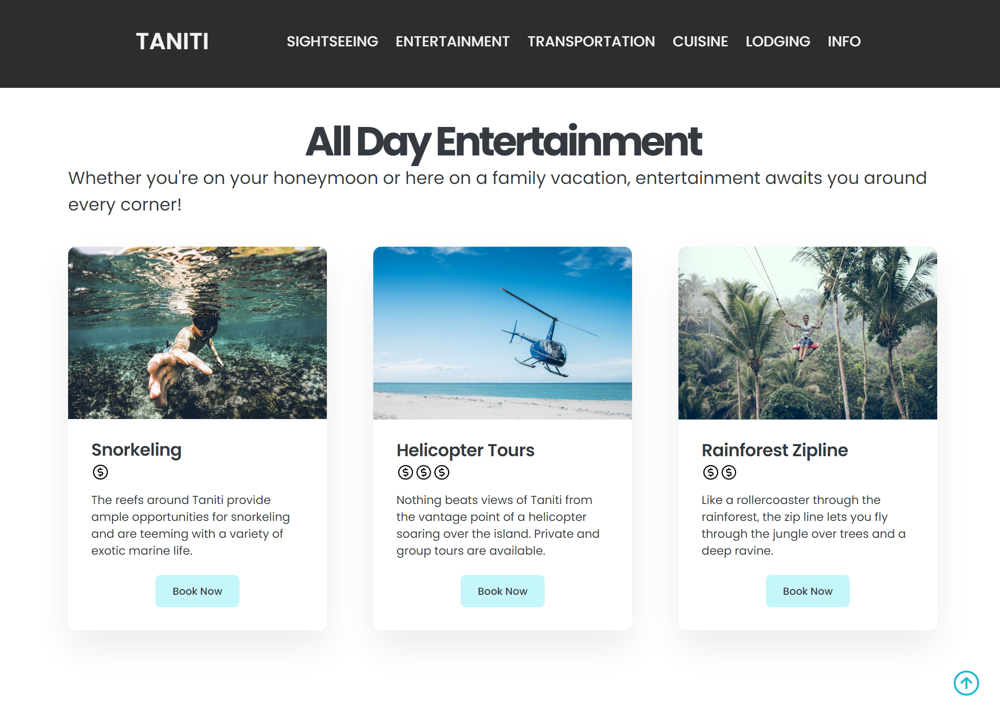
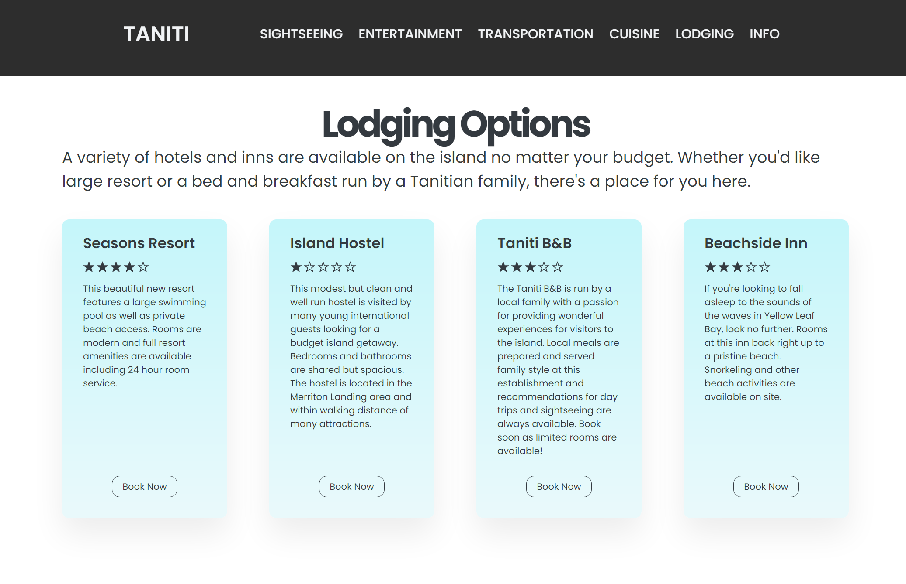
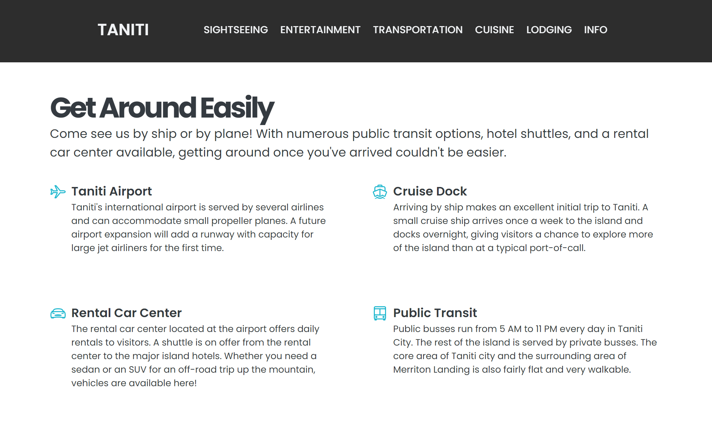

[![MIT License][license-shield]][license-url]
[![LinkedIn][linkedin-shield]][linkedin-url]

# Taniti Tourism Website
A sample tourism website for the fictional island of Taniti

## About the Project
I built this site initially for a UX Design class at Western Governor's University. We were given basic content to use in the site, but the design was left up to us. Since then, I've continued adding to the design as my CSS and HTML skills have developed.

### Landing Page

### Sightseeing Section

### Entertainment Section

### Lodging Section

### Transportation Section

## Live Website
The full website is available [here](https://example.com).

## Special Thanks
Special thanks to @jonasschmedtmann and his Udemy course [Build Responsive Real-World Websites with HTML and CSS](https://www.udemy.com/course/design-and-develop-a-killer-website-with-html5-and-css3/).

[license-shield]: https://img.shields.io/github/license/othneildrew/Best-README-Template.svg?style=for-the-badge
[license-url]: https://github.com/othneildrew/Best-README-Template/blob/master/LICENSE.txt
[linkedin-shield]: https://img.shields.io/badge/-LinkedIn-black.svg?style=for-the-badge&logo=linkedin&colorB=555
[linkedin-url]: https://linkedin.com/in/samuel-s-jones
